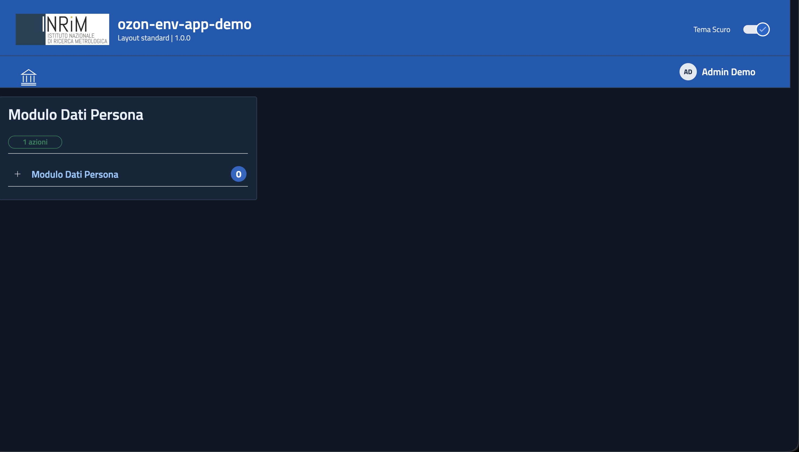
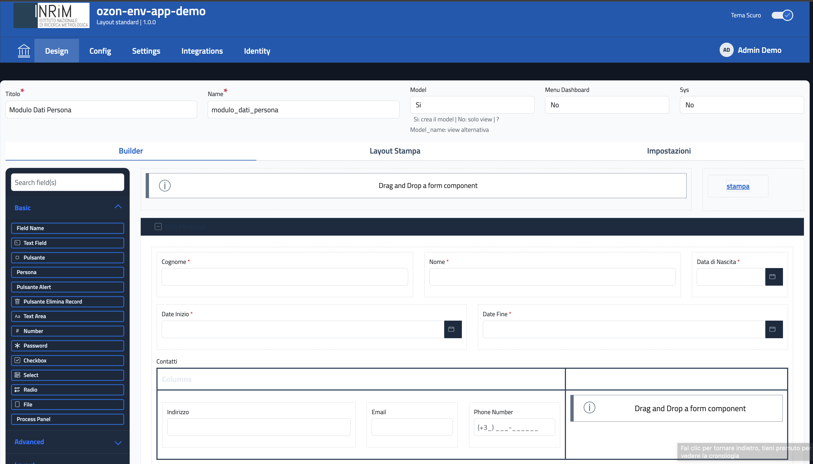
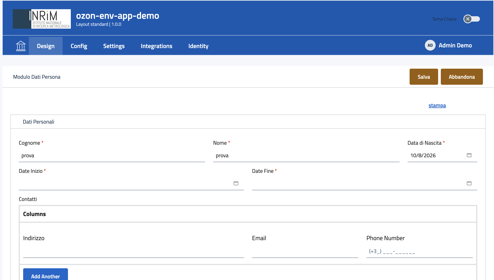
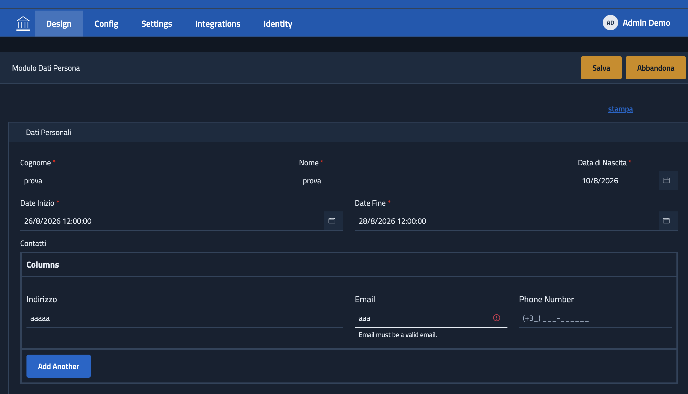

# Inrim Forms Demo

Demo eseguibile di **[INRIM/service-app](https://github.com/INRIM/service-app/tree/3.0)
3.0** (`ozon-env-app`): backend RAD multi-tenant con form Form.io, CRUD
generico su MongoDB, tema AGID/Bootstrap Italia e autenticazione Keycloak.

Un solo comando tira su tutto lo stack — Keycloak, MongoDB, backend,
companion service, web-client — con un plugin di esempio (`demo`) gia'
installato e 4 utenti di test:

```bash
demo/run_demo.sh up
```

Il repo contiene **solo** la demo (plugin, env, provisioning, orchestratore).
I compose di backend e web-client stanno in `service-app`: `run_demo.sh` lo
clona in `./service-app` — dentro questo repo, gitignorato — se non c'e'
gia', e lo aggiorna con un fast-forward se c'e'. Non scrive niente fuori
dalla root del repo e non serve avere niente dello stack preinstallato:
basta clonare questo repo e lanciare lo script.

> La 1.x di questo progetto (Flask + form builder standalone) e' stata
> sostituita da service-app; il codice storico resta nella storia git.

## Documentazione

- Demo: <https://inrim.github.io/service-app/demo/>
- Ozon App (la piattaforma): <https://inrim.github.io/service-app/>

## Requisiti

Docker Desktop attivo, piu' `git`, `curl`, `jq`, `openssl`. Le immagini
arrivano da GHCR (`ghcr.io/inrim/ozon-env-app/*`, `ghcr.io/inrim/ozon-formio`),
pubbliche: nessun `docker login`.

## Comandi

```bash
demo/run_demo.sh up       # installa (clone incluso) e avvia — idempotente
demo/run_demo.sh status   # stato dei container
demo/run_demo.sh down     # ferma i container (i dati restano nei volumi)
demo/run_demo.sh reset    # ferma e cancella anche i dati (mongo/keycloak)
demo/clean_demo.sh        # pulizia totale: container/volumi/immagini/orfani,
                          # .env generati e segreti locali
```

Override utili (env):

| Variabile | Default | A cosa serve |
|---|---|---|
| `SERVICE_APP_DIR` | `demo/../service-app` (root del repo) | usare un checkout di service-app gia' esistente altrove |
| `SERVICE_APP_REPO` | `https://github.com/INRIM/service-app.git` | fork/mirror |
| `SERVICE_APP_REF` | `3.0` | branch o tag da clonare/aggiornare |

## Cosa ottieni

| Cosa | URL | Credenziali |
|---|---|---|
| Web app | http://localhost:4200 | utenti demo, sotto |
| Backend API | http://localhost:7999 | — |
| Keycloak admin console | http://localhost:8082 | `admin` / password generata (stampata a fine run, salvata in `demo/.env.secrets`) |

Utenti demo (realm Keycloak `backend`), **username = password**: `admin`,
`user`, `operator`, `manager`.

## Screenshot

Dashboard: la card del form arriva gia' pronta col plugin `demo`, senza
passare dal builder.



Builder drag&drop (formio.js): la form si disegna trascinando i campi.



Compilazione della form, tema chiaro.



Stessa form in tema scuro, con la validazione dei campi.



## Struttura

```
demo/
├── plugin/                   il plugin "demo" montato in /plugins/demo
│   ├── config.json           manifest (module_name, schema, datas)
│   ├── schema/components.json  la form "Modulo Dati Persona"
│   └── data/                 menu_group + action (list/form/save)
├── .env.demo                 template env del backend (segnaposto, no segreti)
├── .env.client-demo          template env del web-client
├── docker-compose.demo.yml   override: aggiunge Keycloak + monta il plugin
├── provision_keycloak.sh     realm + client web + client M2M + utenti
├── seed_groups.py            gruppi group_users (user/operator/manager + M2M)
├── run_demo.sh               orchestratore: clone, env, up, provisioning, seed
├── clean_demo.sh             pulizia totale
└── tests/                    test dello script di provisioning
service-app/                  checkout di INRIM/service-app (clonato qui, gitignorato)
gallery/                      screenshot usati in questo README
```

Dettagli su architettura, login BFF/Keycloak e porting del plugin:
[`demo/README.md`](demo/README.md).

## Nomi dei container

Dalla 3.0 i `container_name` dei compose di service-app sono variabili
obbligatorie: la demo li valorizza in `demo/.env.demo`
(`OZON_ENV_APP_CONTAINER_NAME`, `..._DB_...`, `..._MAIL_SENDER_...`,
`..._CALENDAR_SCHEDULER_...`, `..._IDENTITY_MANAGER_...`,
`KEYCLOAK_CONTAINER_NAME`) e in `demo/.env.client-demo`
(`OZON_APP_WEB_CONTAINER_NAME`). Sono anche gli hostname sulla rete Docker:
cambiandoli vanno allineati `MONGO_URL`, `SCHEDULER_RUN_BASE_URL` e
`BACKEND_UPSTREAM`. Gli script non contengono nomi fissi. Dettagli in
[`demo/README.md`](demo/README.md#nomi-dei-container).

## Segreti

`run_demo.sh` genera `MONGO_PASS`, `SESSION_SECRET` e
`KEYCLOAK_ADMIN_PASSWORD` al primo avvio e li salva in `demo/.env.secrets`
(gitignorato), insieme ai secret dei client Keycloak ricavati dal
provisioning. I file versionati (`demo/.env.demo`, `demo/.env.client-demo`)
sono template con segnaposto: **non ci vanno segreti veri**. Gli `.env`
operativi vengono scritti dentro il checkout locale di service-app
(`service-app/backend/.env`, `service-app/app/.env`) e rigenerati a ogni run.

## Licenza

MIT — vedi [LICENSE](https://github.com/INRIM/inrim-forms-demo/blob/master/LICENSE).
